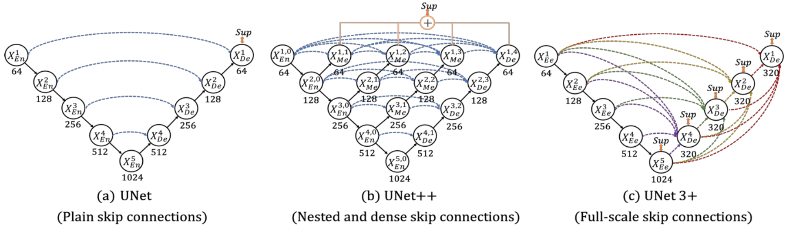

# UNET 3+-Implementation-in-TensorFlow & PyTorch
This repository demonstrates the implementation of UNet 3+ in TensorFlow & PyTorch

## What is UNET 3+
- UNet 3+ is an advanced medical image segmentation architecture, building upon UNet++, *featuring full-scale skip connections*, *deep supervision*, and a *classification-guided module* for improved accuracy and reduced parameters.
- The model efficiently captures *fine-grained details* and *coarse-grained semantics* in medical images, addressing issues like over-segmentation and false positives.

## Architecture

|  |
| :--: |
| *Comparison of (a) UNet, (b) UNet++ and (c) proposed UNet 3+.* |

## Contact
For more follow me on:

- <a href="https://www.youtube.com/idiotdeveloper"> YouTube </a>
- <a href="https://facebook.com/idiotdeveloper"> Facebook </a>
- <a href="https://twitter.com/nikhilroxtomar"> Twitter </a>
- <a href="https://www.instagram.com/nikhilroxtomar"> Instagram </a>
- <a href="https://t.me/idiotdeveloper"> Telegram </a>
